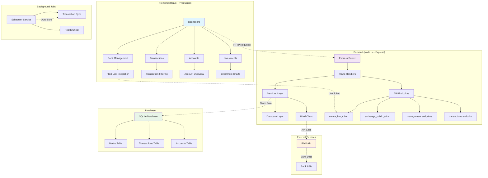
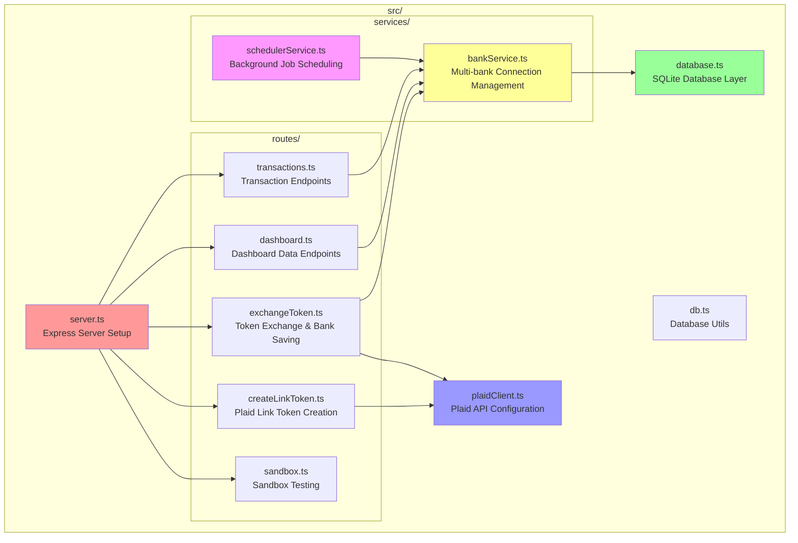
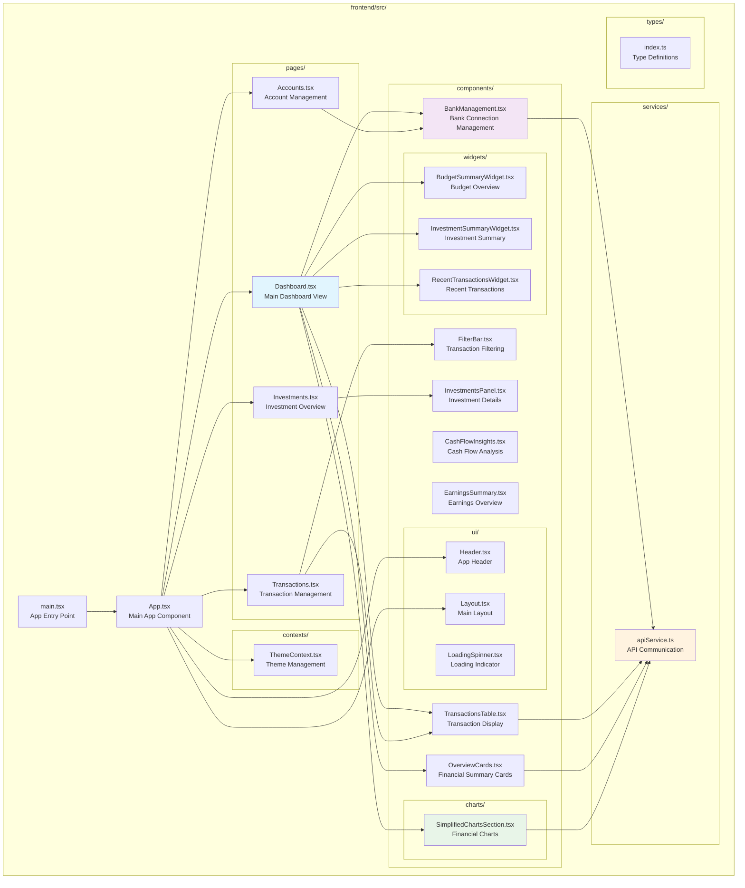
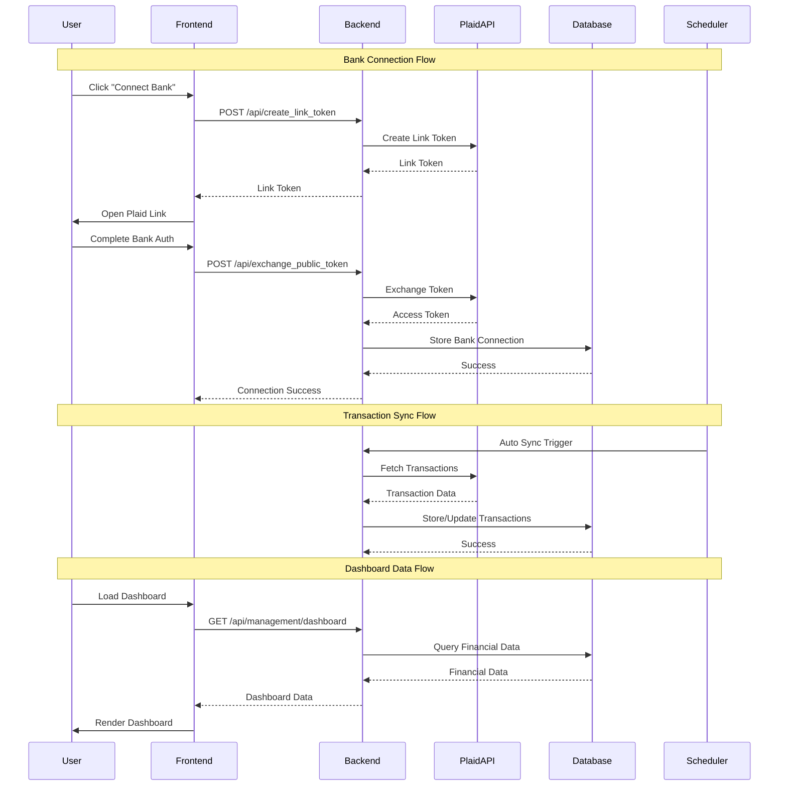

# 💰 MoneyMosaic - Personal Finance Dashboard

A comprehensive personal finance dashboard that connects multiple banks and tracks all your finances in one place using the Plaid API.


## 📋 Table of Contents

- [✨ Features](#-features)
- [🚀 Quick Start](#-quick-start)
- [📋 Prerequisites](#-prerequisites)
- [⚙️ Environment Configuration](#️-environment-configuration)
- [🏗️ Architecture](#️-architecture)
- [🔧 API Endpoints](#-api-endpoints)
- [🧪 Testing](#-testing)
- [🛠️ Development](#️-development)
- [🔒 Security & Production](#-security--production)
- [❓ FAQ](#-faq)
- [📋 Common Issues](#-common-issues)
- [🎯 Next Steps](#-next-steps)

## ✨ Features

- **Multi-Bank Support**: Connect unlimited bank accounts from different institutions
- **Real-time Sync**: Automatic transaction syncing every 6 hours with manual sync option
- **Financial Insights**: Comprehensive spending analysis with interactive charts and category filtering
- **Dynamic Filters**: Time-based filtering and category-specific analysis for spending patterns
- **Modern Interface**: Responsive React frontend with dark/light mode support
- **Secure Storage**: Local SQLite database with transaction deduplication
- **Connection Health**: Automatic monitoring and error handling with visual status indicators
- **Privacy-Focused**: Single-user design with no external data sharing

## 🚀 Quick Start

```bash
# 1. Clone and setup
git clone https://github.com/yourusername/moneymosaic.git
cd moneymosaic

# 2. Run the quick setup script
chmod +x quick-start.sh
./quick-start.sh

# 3. Add your Plaid credentials to .env file
# Get free credentials at: https://dashboard.plaid.com/

# 4. Start both servers
npm run dev:both

# 5. Open http://localhost:3000 (frontend)
# Backend API runs on http://localhost:8080
```

### Alternative: Manual Startup

If you prefer to run servers separately:

```bash
# Terminal 1 - Backend (API server)
npm run dev

# Terminal 2 - Frontend (React app)
npm run dev:frontend
```

## 📋 Prerequisites

- **Node.js** 18+ and npm
- **Plaid Account** (free at [dashboard.plaid.com](https://dashboard.plaid.com/))

## ⚙️ Environment Configuration

Create a `.env` file with your Plaid credentials:

```env
# Plaid API Configuration
PLAID_CLIENT_ID=your_plaid_client_id
PLAID_SECRET=your_plaid_secret_key
PLAID_ENV=sandbox
PLAID_REDIRECT_URI=http://localhost:3000/oauth-return

# Server Configuration
PORT=8080

# Background Job Configuration
SYNC_INTERVAL_HOURS=6
```

## 🏗️ Architecture

### System Overview



### Backend Structure



### Frontend Structure



### Data Flow Architecture



## 🔧 API Endpoints

### Bank Management

- `POST /api/create_link_token` - Create Plaid Link token
- `POST /api/exchange_public_token` - Connect new bank
- `GET /api/management/connected_banks` - List all connected banks
- `DELETE /api/management/banks/:id` - Remove bank connection
- `GET /api/management/health_check` - Check connection health

### Transactions & Data

- `GET /api/management/dashboard` - Get dashboard data
- `POST /api/management/sync` - Manual sync trigger
- `GET /api/management/transactions` - Get transactions with filters

## 🧪 Testing

MoneyMosaic includes comprehensive testing with 70%+ coverage:

```bash
# Run all tests
npm test

# Run with coverage
npm run test:coverage

# Run specific test
npm test -- bankService.test.ts
```

**Test Coverage:**

- ✅ Unit Tests: Database, BankService, SchedulerService, PlaidClient
- ✅ Integration Tests: Complete API endpoint coverage
- ✅ Postman Collection: Manual API testing

## 🛠️ Development

### Development Commands

#### Quick Start

```bash
npm run dev:both        # Start both backend + frontend
```

#### Individual Servers

```bash
npm run dev            # Backend only (port 8080)
npm run dev:frontend   # Frontend only (port 3000)
```

#### Build & Production

```bash
npm run build          # Build both backend + frontend
npm start              # Start production server
```

#### Testing

```bash
npm test               # Run all tests
npm run test:coverage  # Run with coverage report
npm run test:watch     # Run in watch mode
```

### Building for Production

```bash
npm run build
npm start
```

### Database Location

- Development: `./data/moneymosaic.db`
- Automatic creation and migration
- Backup recommended for production

## 🔒 Security & Production

### Production Deployment

- Use `production` Plaid environment
- Implement user authentication
- Add HTTPS and secure headers
- Regular security updates

### Data Privacy

- All data stored locally in SQLite
- No third-party data sharing
- User controls all connections
- Easy data export/deletion

## ❓ FAQ

**Can you connect multiple banks?**
✅ Yes! Connect unlimited banks with persistent connections.

**Do connections expire?**
✅ Generally no, but banks may revoke access if passwords change or accounts are closed.

**Is data persistent?**
✅ Yes! All data stored in SQLite with transaction history preserved.

**Background sync available?**
✅ Yes! Automatic sync every 6 hours with manual triggers available.

## 📋 Common Issues

**Connection Failures:**

- Check Plaid credentials in `.env`
- Verify institution supports Plaid
- Review error logs for API limits

**Sync Problems:**

- Manual sync to test connectivity
- Check background job status
- Review institution health status

**Database Issues:**

- Ensure write permissions in `data/` directory
- Check SQLite installation

## 🎯 Next Steps

Consider adding:

- User authentication system
- Budget tracking and alerts
- Investment account support
- Data export functionality
- Advanced analytics

---

Built with ❤️ using Plaid API, TypeScript, SQLite, React, and modern web technologies.
