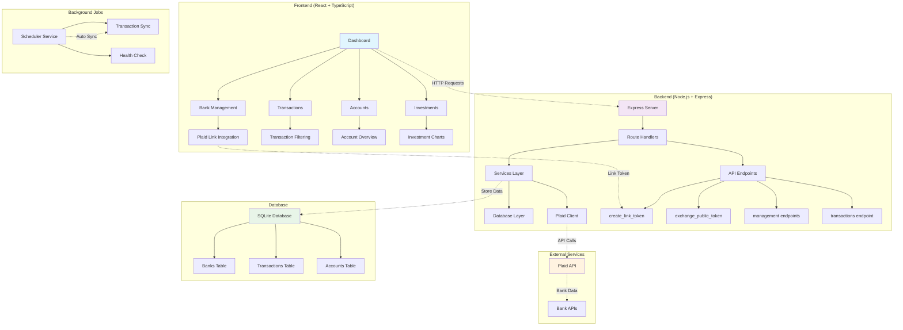
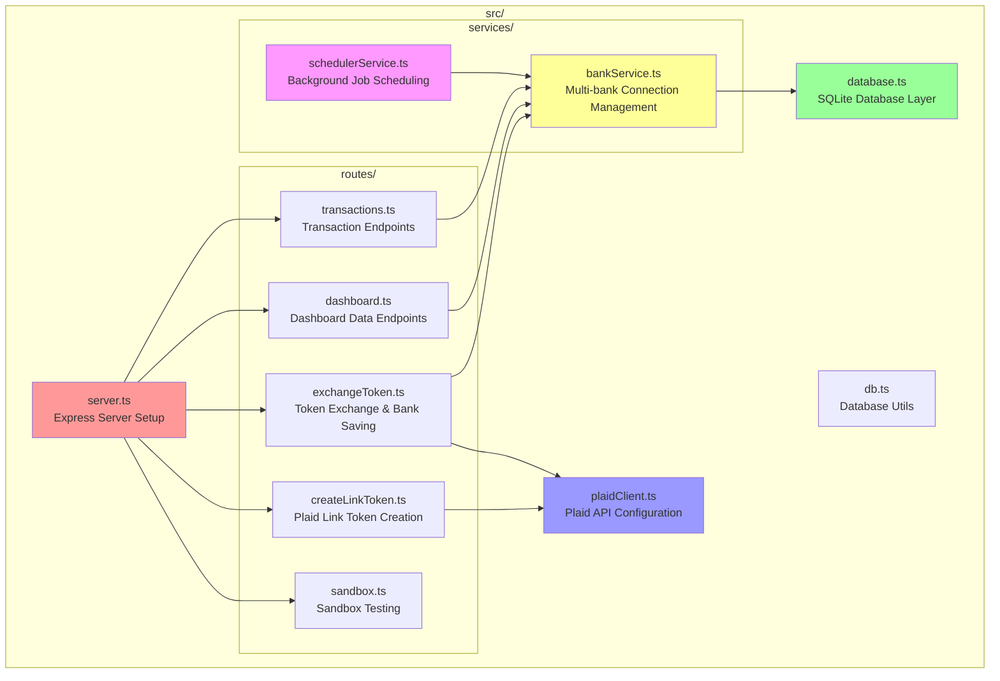
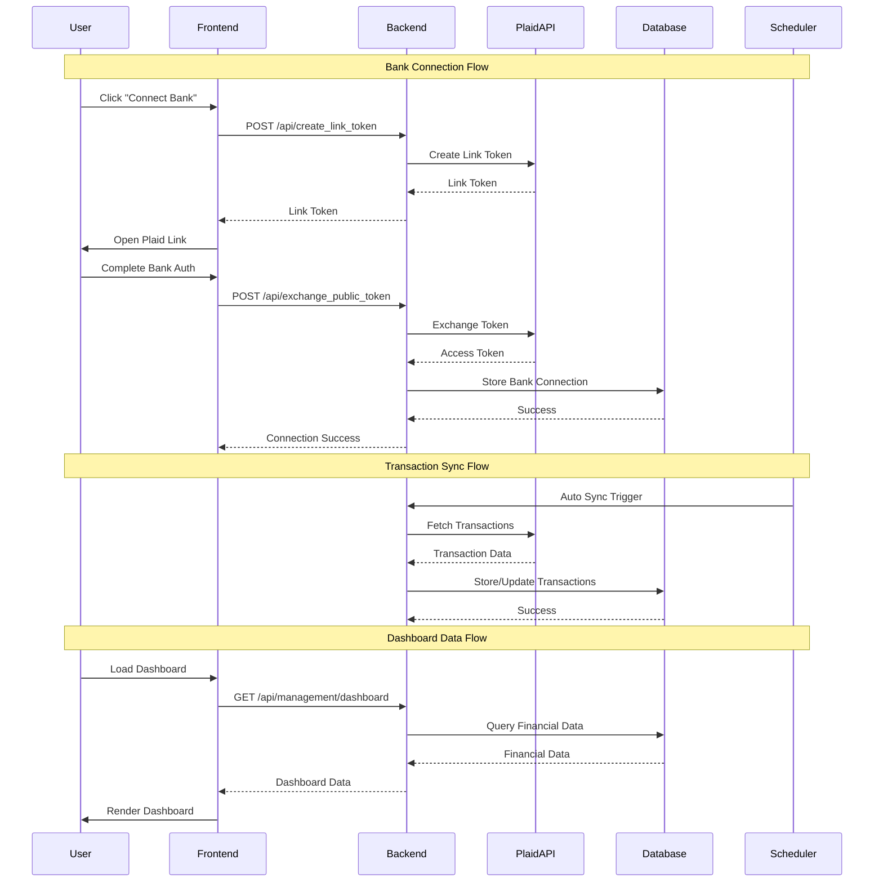

# MoneyMosaic - Project Structure & Best Practices

## 📁 Project Structure

### System Overview

```mermaid
graph TB
    subgraph "Frontend (React + TypeScript)"
        A[Dashboard] --> B[Bank Management]
        A --> C[Transactions]
        A --> D[Accounts]
        A --> E[Investments]

        B --> F[Plaid Link Integration]
        C --> G[Transaction Filtering]
        D --> H[Account Overview]
        E --> I[Investment Charts]
    end

    subgraph "Backend (Node.js + Express)"
        J[Express Server] --> K[Route Handlers]
        K --> L[Services Layer]
        L --> M[Database Layer]
        L --> N[Plaid Client]

        K --> O[API Endpoints]
        O --> P["create_link_token"]
        O --> Q["exchange_public_token"]
        O --> R["management endpoints"]
        O --> S["transactions endpoint"]
    end

    subgraph "External Services"
        T[Plaid API]
        U[Bank APIs]
    end

    subgraph "Database"
        V[SQLite Database]
        V --> W[Banks Table]
        V --> X[Transactions Table]
        V --> Y[Accounts Table]
    end

    subgraph "Background Jobs"
        Z[Scheduler Service]
        Z --> AA[Transaction Sync]
        Z --> BB[Health Check]
    end

    A -.->|HTTP Requests| J
    F -.->|Link Token| P
    N -.->|API Calls| T
    T -.->|Bank Data| U
    L -.->|Store Data| V
    Z -.->|Auto Sync| AA

    style A fill:#e1f5fe
    style J fill:#f3e5f5
    style V fill:#e8f5e8
    style T fill:#fff3e0
```

### Backend Structure

```mermaid
graph TD
    subgraph "src/"
        A["server.ts<br/>Express Server Setup"]
        B["database.ts<br/>SQLite Database Layer"]
        C["plaidClient.ts<br/>Plaid API Configuration"]
        D["db.ts<br/>Database Utils"]

        subgraph "routes/"
            E["createLinkToken.ts<br/>Plaid Link Token Creation"]
            F["exchangeToken.ts<br/>Token Exchange & Bank Saving"]
            G["dashboard.ts<br/>Dashboard Data Endpoints"]
            H["transactions.ts<br/>Transaction Endpoints"]
            I["sandbox.ts<br/>Sandbox Testing"]
        end

        subgraph "services/"
            J["bankService.ts<br/>Multi-bank Connection Management"]
            K["schedulerService.ts<br/>Background Job Scheduling"]
        end
    end

    A --> E
    A --> F
    A --> G
    A --> H
    A --> I

    E --> C
    F --> C
    F --> J
    G --> J
    H --> J

    J --> B
    K --> J

    style A fill:#ff9999
    style B fill:#99ff99
    style C fill:#9999ff
    style J fill:#ffff99
    style K fill:#ff99ff
```

### Data Flow Architecture

```mermaid
sequenceDiagram
    participant User
    participant Frontend
    participant Backend
    participant PlaidAPI
    participant Database
    participant Scheduler

    Note over User,Scheduler: Bank Connection Flow
    User->>Frontend: Click "Connect Bank"
    Frontend->>Backend: POST /api/create_link_token
    Backend->>PlaidAPI: Create Link Token
    PlaidAPI-->>Backend: Link Token
    Backend-->>Frontend: Link Token
    Frontend->>User: Open Plaid Link
    User->>Frontend: Complete Bank Auth
    Frontend->>Backend: POST /api/exchange_public_token
    Backend->>PlaidAPI: Exchange Token
    PlaidAPI-->>Backend: Access Token
    Backend->>Database: Store Bank Connection
    Database-->>Backend: Success
    Backend-->>Frontend: Connection Success

    Note over User,Scheduler: Transaction Sync Flow
    Scheduler->>Backend: Auto Sync Trigger
    Backend->>PlaidAPI: Fetch Transactions
    PlaidAPI-->>Backend: Transaction Data
    Backend->>Database: Store/Update Transactions
    Database-->>Backend: Success

    Note over User,Scheduler: Dashboard Data Flow
    User->>Frontend: Load Dashboard
    Frontend->>Backend: GET /api/management/dashboard
    Backend->>Database: Query Financial Data
    Database-->>Backend: Financial Data
    Backend-->>Frontend: Dashboard Data
    Frontend->>User: Render Dashboard
```
